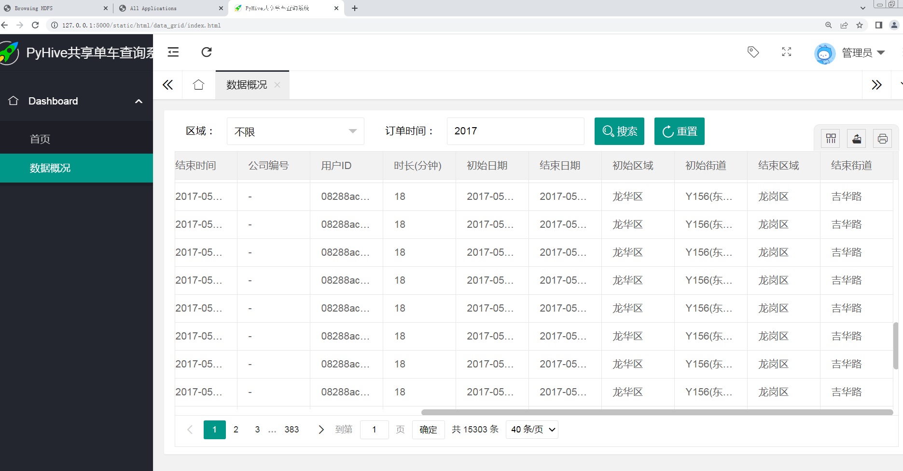
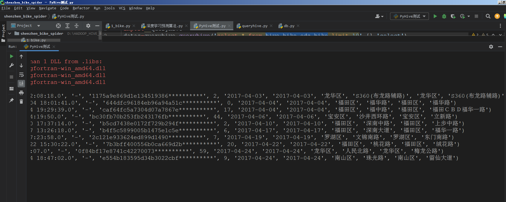

## 计算机毕业设计PyHive+Hadoop深圳共享单车预测系统 共享单车数据分析可视化大屏 共享单车爬虫 共享单车数据仓库 机器学习 深度学习 PySpark

## 要求
### 源码有偿！一套(论文 PPT 源码+sql脚本+教程)

### 
### 加好友前帮忙start一下，并备注github有偿新共享单车25
### 我的QQ号是2827724252或者798059319或者 1679232425或者微信:bysj2023nb 或bysj1688

# 

### 加qq好友说明（被部分 网友整得心力交瘁）：
    1.加好友务必按照格式备注
    2.避免浪费各自的时间！
    3.当“客服”不容易，repo 主是体面人，不爆粗，性格好，文明人。
	
## 功能步骤
1.Python采集深圳政府公开数据平台的共享单车数据(最大可采集上亿2017-2021数据)，并用百度逆地理编码服务解析经纬度获取位置信息。并将数据上传hdfs；
2.可使用sklearn、卷积神经网络等算法对数据进行分析，对共享单车的订单量进行有效预测；
3.使用PyHive、Hadoop等技术对hdfs中的共线单车数据进行离线分析(有需要的话后期可以改造成PySpark Scala Spark Flink PyFlink分析)；
4.对3中的分析指标使用sqoop导入到mysql数据库；
5.使用flask+echarts+layui搭建可视化系统、hive数据查询系统；
6.大屏端直接查询Mysql指标表的数据完成可视化。hive数据仓库查询系统连接虚拟机中的hive进行多条件数据检索；

## 创新点：
爬虫、百度逆地理编码解析、预测算法、可视化大屏、PyHive新技术的应用	

## 演示视频
https://www.bilibili.com/video/BV1RW42197rm/

## 截图

